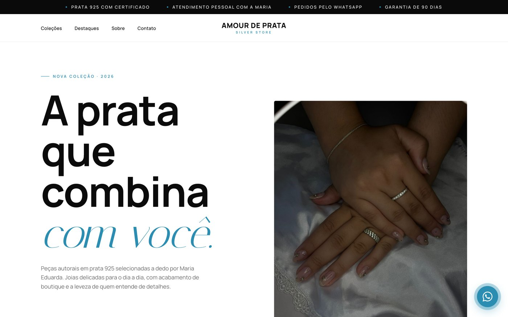
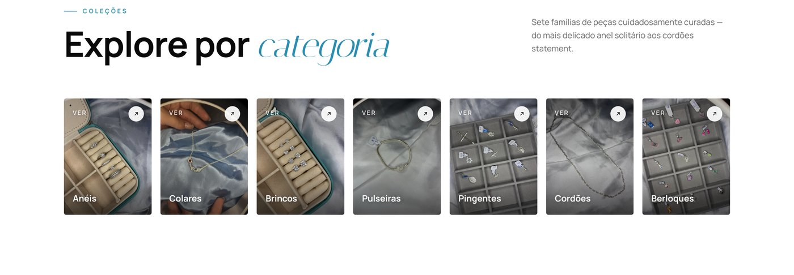
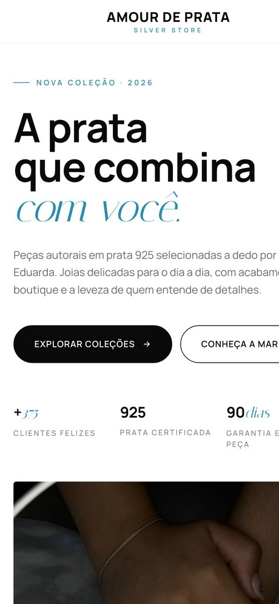

# Amour de Prata — Landing Page

> Landing page de alta conversão para uma loja de joias em prata 925, construída em HTML/CSS/JS puro — sem framework, sem build, sem dependências de runtime.

**PT-BR** | [EN](#english)

**🔗 Live:** [amourdeprata.vercel.app](https://amourdeprata.vercel.app) &nbsp;·&nbsp; **Instagram:** [@amour_de_prata](https://www.instagram.com/amour_de_prata/)

### Preview







---

## Português

### Contexto

A **Amour de Prata** é uma loja de joias em prata 925 tocada pessoalmente pela Maria Eduarda, com vendas concluídas via **WhatsApp e Instagram**. O desafio não era um e-commerce com carrinho, e sim uma vitrine que **gera contato qualificado**: apresentar a marca com cara de boutique, mostrar o portfólio de peças e levar o visitante até a conversa de venda com o mínimo de atrito.

O projeto foi pensado de ponta a ponta — design, copy, performance, SEO, acessibilidade e instrumentação de conversão — tratando uma página estática com o mesmo rigor de um produto.

### Destaques técnicos

- **Stack mínima e durável** — HTML5 semântico, CSS3 e JavaScript vanilla. Zero framework, zero etapa de build, zero `node_modules`. Carrega rápido e é trivial de manter.
- **Catálogo interativo** — modal *bottom-sheet* com **+140 fotos reais** de produto organizadas em 7 categorias, com **gesto de arrastar para fechar** (Pointer Events), *focus trap* e fechamento por `Esc`.
- **Performance levada a sério** — biblioteca de fotos reduzida de **623 MB → 33 MB** (−95%) sem perda visível; *lazy-loading*, `fetchpriority` no LCP e widget de terceiros carregado sob demanda.
- **SEO & compartilhamento completos** — Open Graph com **imagem social 1200×630 gerada programaticamente**, dados estruturados (`Store` + `FAQPage`), sitemap, canonical e `robots.txt`.
- **Acessibilidade de verdade** — navegação por teclado, `prefers-reduced-motion`, *focus trap* no modal e controles semânticos.
- **Conversão instrumentada** — cada clique de WhatsApp é rastreado por origem (Vercel Analytics), permitindo saber qual CTA converte.
- **PWA-ready & hardening** — `site.webmanifest` instalável, favicons dedicados, página 404 com a marca e *headers* de segurança via `vercel.json`.

### Decisões de produto e engenharia

#### 🎨 Design & UX
Identidade editorial de boutique: tipografia serifada (**Italiana**) em itálico para títulos com Manrope no corpo, paleta prata/papel com acento ciano, respiro generoso e microinterações discretas (hero flutuante, contadores animados, *fade-up* no scroll). Cada família de produto é apresentada num card com **foto real** da peça, não ícone genérico.

#### ⚡ Performance
- **Otimização de imagens**: as fotos originais (4032×3024, 4–9 MB cada) foram redimensionadas para ~1000 px e recomprimidas — **623 MB → 33 MB**. PNGs do hero/perfil convertidos para JPEG (~2,4 MB → ~430 KB).
- **Carregamento**: `loading="lazy"` + `decoding="async"` nas imagens abaixo da dobra; `fetchpriority="high"` na imagem do hero (LCP).
- **Terceiros sob demanda**: o feed do Instagram (Behold.so) só baixa o script quando entra no viewport (`IntersectionObserver`).
- **Anti-CLS**: `width`/`height` explícitos em todas as imagens para reservar espaço e zerar *layout shift* (Core Web Vitals).
- **Fontes enxutas**: apenas os pesos realmente usados são requisitados.

#### 🔍 SEO & redes sociais
- **Imagem Open Graph dedicada (1200×630)** com headline e CTA, **gerada por script** ([`scripts/make_og.py`](scripts/make_og.py), Pillow) — versionada e reprodutível.
- **Dados estruturados** JSON-LD: `Store` (marca, logo, telefone, redes) e `FAQPage` (elegível a *rich snippet*).
- Open Graph + Twitter Card completos, `canonical`, `theme-color`, `sitemap.xml` e `robots.txt`.

#### ♿ Acessibilidade
- Cards de categoria como `<button>` semântico (não `<a>` enganoso), com `:focus-visible`.
- `prefers-reduced-motion` respeitado em CSS e JS (desliga animações e o contador).
- Modal do catálogo com *focus trap*, retorno de foco ao fechar e fechamento por `Esc`.
- Menu mobile acessível com `aria-expanded`/`aria-controls`.

#### 📈 Conversão
- Botões de WhatsApp em pontos estratégicos (hero, sobre, CTA, catálogo, FAB flutuante) com **mensagem pré-preenchida** por contexto.
- **Rastreio de evento** por origem no Vercel Analytics — métrica direta de quantos contatos o site gera e de onde.

#### 🔒 Infra & segurança
- `vercel.json` com *headers* (`X-Content-Type-Options`, `X-Frame-Options`, `Referrer-Policy`, `Permissions-Policy`) e política de cache para assets.
- `site.webmanifest` + ícones 192/512 → instalável na tela inicial.
- Página **404 personalizada** com saída para o início e para o WhatsApp.

### Stack

| Camada | Escolha |
|---|---|
| Marcação | HTML5 semântico |
| Estilos | CSS3 — custom properties, `clamp()`, grid, animações, `prefers-reduced-motion` |
| Lógica | JavaScript vanilla — `IntersectionObserver`, Pointer Events, `requestAnimationFrame` |
| Ícones | Sprite SVG (`<symbol>`/`<use>`) |
| Feed Instagram | Behold.so (lazy) |
| Fontes | Google Fonts — Manrope + Italiana |
| Analytics | Vercel Web Analytics (eventos customizados) |
| Imagens (tooling) | Python + Pillow / `sips` |
| Hospedagem | Vercel (CDN global) |

### Estrutura

```
amourdeprata/
├── index.html          # Marcação + meta tags (SEO/OG) + JSON-LD + sprite SVG
├── style.css           # Estilos (design system em custom properties)
├── main.js             # Catálogo, gestos, animações, menu, tracking, a11y
├── 404.html            # Página de erro com a marca
├── vercel.json         # Headers de segurança + cache
├── site.webmanifest    # PWA (instalável)
├── robots.txt
├── sitemap.xml
├── scripts/            # Utilitários reprodutíveis (não vão para produção)
│   ├── make_og.py      # Gera a imagem Open Graph 1200×630
│   ├── add_img_dims.py # Injeta width/height nas imagens (anti-CLS)
│   └── dedup_svg.py    # Centraliza ícones SVG em <symbol>
└── assets/
    ├── logo.png
    ├── favicon-16x16.png · favicon-32x32.png · apple-touch-icon.png
    ├── icon-192.png · icon-512.png      # ícones do manifest
    ├── og-image.jpg                     # imagem de compartilhamento
    └── photos/                          # +140 fotos de produto (otimizadas)
```

### Resultados

| Métrica | Antes | Depois |
|---|---|---|
| Peso das fotos | 623 MB | **33 MB** (−95%) |
| Imagens do hero (PNG → JPEG) | ~2,4 MB | **~430 KB** |
| Layout shift (CLS) | imagens sem dimensão | **dimensões reservadas** |
| Preview ao compartilhar | sem imagem/título | **card OG 1200×630** |
| Dados estruturados | nenhum | **Store + FAQPage** |

### Rodar localmente

Sem etapa de build. Abra o `index.html` ou use um servidor estático:

```bash
npx serve .
```

Para regenerar artefatos (opcional, requer Python + Pillow):

```bash
python3 scripts/make_og.py        # imagem Open Graph
python3 scripts/add_img_dims.py   # dimensões das imagens
python3 scripts/dedup_svg.py      # sprite de ícones
```

---

## English

<a name="english"></a>

### Context

**Amour de Prata** is a sterling-silver (925) jewelry store run personally by Maria Eduarda, with sales closed over **WhatsApp and Instagram**. The brief wasn't a checkout-based e-commerce, but a storefront that **generates qualified leads**: present the brand with a boutique feel, showcase the catalog, and move visitors into the sales conversation with minimal friction.

The project was handled end to end — design, copy, performance, SEO, accessibility and conversion instrumentation — treating a static page with the rigor of a product.

### Technical highlights

- **Minimal, durable stack** — semantic HTML5, CSS3 and vanilla JS. No framework, no build step, no `node_modules`. Fast to load, trivial to maintain.
- **Interactive catalog** — bottom-sheet modal with **140+ real product photos** across 7 categories, with **swipe-down-to-close** (Pointer Events), focus trap and `Esc` to close.
- **Performance taken seriously** — photo library cut from **623 MB → 33 MB** (−95%) with no visible loss; lazy-loading, LCP `fetchpriority`, and a third-party widget loaded on demand.
- **Complete SEO & sharing** — Open Graph with a **programmatically generated 1200×630 social image**, structured data (`Store` + `FAQPage`), sitemap, canonical and `robots.txt`.
- **Real accessibility** — keyboard navigation, `prefers-reduced-motion`, modal focus trap and semantic controls.
- **Instrumented conversion** — every WhatsApp click is tracked by source (Vercel Analytics) to reveal which CTA converts.
- **PWA-ready & hardened** — installable `site.webmanifest`, dedicated favicons, branded 404 page and security headers via `vercel.json`.

### Product & engineering decisions

#### 🎨 Design & UX
Editorial boutique identity: serif display type (**Italiana**, italic) paired with Manrope for body, a silver/paper palette with a cyan accent, generous whitespace and restrained microinteractions (floating hero, animated counters, scroll fade-up). Each product family is shown on a card with a **real photo**, not a generic icon.

#### ⚡ Performance
- **Image optimization**: originals (4032×3024, 4–9 MB each) resized to ~1000 px and recompressed — **623 MB → 33 MB**. Hero/profile PNGs converted to JPEG (~2.4 MB → ~430 KB).
- **Loading**: `loading="lazy"` + `decoding="async"` below the fold; `fetchpriority="high"` on the hero (LCP).
- **Third-party on demand**: the Instagram feed (Behold.so) only fetches its script when scrolled into view (`IntersectionObserver`).
- **Anti-CLS**: explicit `width`/`height` on every image to reserve space and eliminate layout shift (Core Web Vitals).
- **Lean fonts**: only the weights actually in use are requested.

#### 🔍 SEO & social
- **Dedicated Open Graph image (1200×630)** with headline and CTA, **generated by a script** ([`scripts/make_og.py`](scripts/make_og.py), Pillow) — versioned and reproducible.
- **Structured data** JSON-LD: `Store` (brand, logo, phone, socials) and `FAQPage` (rich-snippet eligible).
- Full Open Graph + Twitter Card, `canonical`, `theme-color`, `sitemap.xml` and `robots.txt`.

#### ♿ Accessibility
- Category cards as semantic `<button>` (not a misleading `<a>`), with `:focus-visible`.
- `prefers-reduced-motion` honored in CSS and JS (disables animations and the counter).
- Catalog modal with focus trap, focus restoration on close, and `Esc` to close.
- Accessible mobile menu with `aria-expanded`/`aria-controls`.

#### 📈 Conversion
- WhatsApp buttons at strategic points (hero, about, CTA, catalog, floating FAB) with a **context-aware pre-filled message**.
- **Per-source event tracking** in Vercel Analytics — a direct read on how many leads the site produces and where they come from.

#### 🔒 Infra & security
- `vercel.json` with headers (`X-Content-Type-Options`, `X-Frame-Options`, `Referrer-Policy`, `Permissions-Policy`) and an asset caching policy.
- `site.webmanifest` + 192/512 icons → add-to-home-screen installable.
- A **custom 404** page with exits to home and WhatsApp.

### Stack

| Layer | Choice |
|---|---|
| Markup | Semantic HTML5 |
| Styles | CSS3 — custom properties, `clamp()`, grid, animations, `prefers-reduced-motion` |
| Logic | Vanilla JavaScript — `IntersectionObserver`, Pointer Events, `requestAnimationFrame` |
| Icons | SVG sprite (`<symbol>`/`<use>`) |
| Instagram feed | Behold.so (lazy) |
| Fonts | Google Fonts — Manrope + Italiana |
| Analytics | Vercel Web Analytics (custom events) |
| Image tooling | Python + Pillow / `sips` |
| Hosting | Vercel (global CDN) |

### Structure

```
amourdeprata/
├── index.html          # Markup + meta (SEO/OG) + JSON-LD + SVG sprite
├── style.css           # Styles (custom-property design system)
├── main.js             # Catalog, gestures, animations, menu, tracking, a11y
├── 404.html            # Branded error page
├── vercel.json         # Security headers + caching
├── site.webmanifest    # PWA (installable)
├── robots.txt
├── sitemap.xml
├── scripts/            # Reproducible tooling (not shipped)
│   ├── make_og.py      # Generates the 1200×630 Open Graph image
│   ├── add_img_dims.py # Injects width/height into images (anti-CLS)
│   └── dedup_svg.py    # Centralizes SVG icons into <symbol>
└── assets/
    ├── logo.png
    ├── favicon-16x16.png · favicon-32x32.png · apple-touch-icon.png
    ├── icon-192.png · icon-512.png      # manifest icons
    ├── og-image.jpg                     # social sharing image
    └── photos/                          # 140+ optimized product photos
```

### Results

| Metric | Before | After |
|---|---|---|
| Photo payload | 623 MB | **33 MB** (−95%) |
| Hero images (PNG → JPEG) | ~2.4 MB | **~430 KB** |
| Layout shift (CLS) | undimensioned images | **reserved dimensions** |
| Share preview | no image/title | **1200×630 OG card** |
| Structured data | none | **Store + FAQPage** |

### Running locally

No build step. Open `index.html` or use any static server:

```bash
npx serve .
```

To regenerate artifacts (optional, requires Python + Pillow):

```bash
python3 scripts/make_og.py        # Open Graph image
python3 scripts/add_img_dims.py   # image dimensions
python3 scripts/dedup_svg.py      # icon sprite
```
